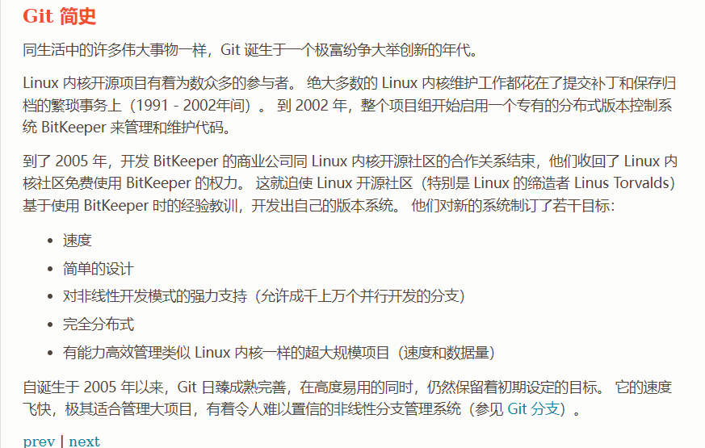

# Git概述

### 开发中的实际场景

场景一：**用来备份**

场景二：**代码还原**

​	需要做一个很复杂的功能，终于有点眉头了，想要添加代码到项目，可是代码已经被改的面目全非了，这个时候我们可以念咒语（git reset --hard commitID）回到过去。

场景三：**协同开发**

​	小明在hello.txt第三行写到”Boss is bug!“，然后上传到了服务器。随后小刚在hello.txt第四行添加了”XiaoMing is right“，也上传到了服务器，可是把小明写的给覆盖掉了~

场景四：**问题追溯**

​	看看是哪个小B崽子在什么时间写了什么bug

### 版本控制器的方式

a.集中式版本控制工具（svn、cvs），but……没人用了~

​	从中央服务器获取最新代码

b.分布式版本控制工具（git）

​	没有中央服务器，每个人电脑上都是一个完整的版本库

### 历史

