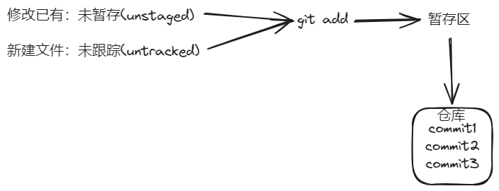

### 1.工作流程

工作区（workspace）⇒暂存区（index）⇒仓库（repository）

### 2.基本命令

1. 查看状态（status）
2. 添加工作区到暂存区（add）
3. 提交暂存区到本地仓库（commit）
4. 查看提交日志

### 3.版本回退

作用：乘坐穿梭机，回到过去

命令形式`git reset --hard commitID`

`git reflog` 查看记录的操作（有id，可用git reset --hard id回到id发生点）

**git log**可加参数：

* --all   显示所有分支
* --pretty=oneline   将提交信息显示为一行
* --abbrev-commit    使输出的commitID更简短
* --graph    以图的形式显示

==小技巧==：可以自定义别名将`git-log`定义为`git log --all --pretty=oneline --abbrev-commit --graph`

### 忽略同步

新建”.gitignore“文件添加内容即可

