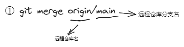

# Git远程仓库

### 4.1添加删除远程仓库	

添加仓库命令：`git remote add`

删除仓库命令：`git remote rm`

#### 连接方式:

1. 链接连接（弃用）
2. ssh连接
3. token验证

### 4.2查看远程仓库

命令：`git remote`

### 4.3推送远程仓库

命令：

```shell
git push [-f] [--set-upstream] [远端仓库名] 本地分支名:远端分支名（分支名一样写一个就行）
```

-f 表示强制推送

--set-upstream  推送到远端并建立起和远端的联系

如果当前分支已经和远端分支关联，则可以省略分支名和远端名，直接 `git push`

### 4.4克隆远程仓库

命令： `git clone`

a端上传更新了代码，b端想要接受a端更新的代码，可以把远程代码合并到本地分支：

​	

②抓取：`git fetch [remote name] [branch name]`

* 抓取指令就是将仓库的更新都抓取到本地，但不会进行合并
* 如果不指定远端名和分支名，则抓取所有分支并更新到当前分支

①+②=③: `git pull`(拉取，会自动合并仓库)


